# Architecture Blueprint: Reusable Workflows and Actions Hierarchy

This document details the architectural layout, design principles, and referencing conventions for standardizing reusable workflows (RWFs) and custom actions in the `armckinney/cicd` repository.

---

## 1. The Three-Tier Architecture

To achieve modularity, dry configurations, and maintainability, our CI/CD workflows are organized into a strict three-tier hierarchy:

```mermaid
graph TD
    subgraph Tier 3: Composite Workflows
        A[rwf-terraform-deployment-ci.yaml]
    end

    subgraph Tier 2: Atomic Workflows
        B[rwf-terraform-static-analysis.yaml]
        C[rwf-terraform-plan.yaml]
        D[rwf-terraform-apply.yaml]
    end

    subgraph Tier 1: Custom Actions
        E[.github/actions/terraform/fmt]
        F[.github/actions/terraform/validate]
        G[.github/actions/terraform/security]
    end

    A -->|Calls| B
    A -->|Calls| C
    A -->|Calls| D

    B -->|Executes| E
    B -->|Executes| F
    B -->|Executes| G

    style A fill:#1a1c1e,stroke:#8b5cf6,stroke-width:2px;
    style B fill:#1a1c1e,stroke:#3b82f6,stroke-width:2px;
    style C fill:#1a1c1e,stroke:#3b82f6,stroke-width:2px;
    style D fill:#1a1c1e,stroke:#3b82f6,stroke-width:2px;
    style E fill:#1a1c1e,stroke:#10b981,stroke-width:1px;
    style F fill:#1a1c1e,stroke:#10b981,stroke-width:1px;
    style G fill:#1a1c1e,stroke:#10b981,stroke-width:1px;
```



### Tier 1: Custom Actions (Atomic Units)
* **Location:** `.github/actions/<category>/<action_name>/action.yaml`
* **Purpose:** Single, self-contained composite actions representing atomic CLI operations (e.g. `go test`, `terraform fmt`, `verge bump`).
* **Design Rule:** They do not define runners, environment permissions, or triggers. They run raw shell scripts or setup utilities in a composite execution environment.

### Tier 2: Reusable Workflows (Orchestrators)
* **Location:** `.github/workflows/rwf-*.yaml`
* **Purpose:** Orchestrate Tier 1 custom actions. They define the runner OS, container images, inputs, outputs, environment-specific permissions, and secrets (OIDC/Azure credentials).
* **Design Rule:** They target a specific domain (e.g. `rwf-terraform-static-analysis.yaml`).

### Tier 3: Composite Reusable Workflows (Recursive Pipelines)
* **Location:** `.github/workflows/rwf-*.yaml` (prefixed with `rwf-`, containing orchestration of multiple workflows).
* **Purpose:** Combine multiple Tier 2 reusable workflows recursively to construct end-to-end pipelines (e.g., `rwf-terraform-deployment-ci.yaml` composing static-analysis, plan, and apply workflows).
* **Design Rule:** They coordinate sequencing, dependency constraints (`needs:`), and secret/input inheritance across the sub-workflows.

---

## 2. Dynamic Library & Reference Resolution

To support dynamic branch testing (local repository runs) and portable execution (external consumer runs) simultaneously:

### 1. Reusable Workflow Chaining (Relative Pathing)
Nested workflow calls between reusable workflows in the same repository **must** use local relative paths:
```yaml
uses: ./.github/workflows/rwf-terraform-plan.yaml
```
GitHub Actions automatically resolves this relative path to the **same commit and branch** as the parent workflow.

### 2. Action references (Self-Resolving Bootstrapping)
Because GitHub Actions cannot resolve relative paths to custom actions called by external repositories, workflows must checkout the CI/CD repository at runtime.
Each job in a reusable workflow executing custom actions must call the bootstrapper action:
```yaml
- name: Checkout CICD library
  uses: armckinney/cicd/.github/actions/github/checkout-cicd-library@main
```
This bootstrapper:
1. Dynamically parses the executing workflow's branch/tag/ref from `job.workflow_ref`.
2. Shallow-clones (`fetch-depth: 1`) and sparse-checkouts (`sparse-checkout: .github`) the library repository to `.github/cicd/`.
3. Subsequent custom action steps execute local actions from that subdirectory: `uses: ./.github/cicd/.github/actions/...`.
