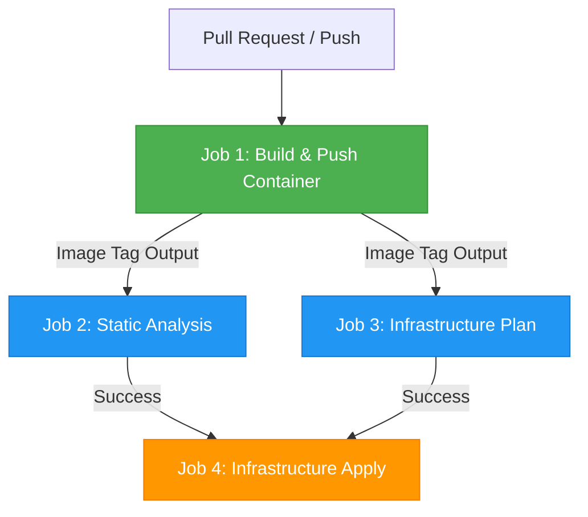

# Pipeline Runtime Guide

This guide demonstrates how to build a unified custom container image at the start of your pipeline and reuse it as the hermetic runner environment for subsequent stages (like linting, testing, and deployment).

## Use Case

Running CI/CD steps directly on hosted runner environments can lead to "it works on my machine" failures due to differences in pre-installed software, tool versions, or OS dependencies. 

By building a lightweight container image representing your exact runtime dependencies as the first job, and passing that image's tag to all subsequent jobs, you ensure that every lint, test, and deploy step runs in an identical, fully controlled, and reproducible sandbox.

## Architecture



## Workflow Implementation

Below is a complete workflow example (`.github/workflows/pipeline-runtime-example.yaml`) implementing this pattern:

```yaml
name: Pipeline with Hermetic Container Runtime

on:
  pull_request:
    branches: [ main ]

env:
  CONFIGURATION: 'production-app'
  ENVIRONMENT: 'production'

jobs:
  # Job 1: Build the Hermetic Container Runtime
  build-runtime:
    uses: ./.github/workflows/rwf-container-build-and-push.yaml
    with:
      # Automatically builds from the Dockerfile in the repository root
      overwrite: false

  # Job 2: Run Static Analysis using the built container as the runtime environment
  static-analysis:
    needs: [ build-runtime ]
    uses: ./.github/workflows/rwf-terraform-static-analysis.yaml
    with:
      container_image: ${{ needs.build-runtime.outputs.container_image }}
      configuration: 'production-app'
      environment: 'production'

  # Job 3: Run Plan using the same container image
  plan-infrastructure:
    needs: [ build-runtime, static-analysis ]
    uses: ./.github/workflows/rwf-terraform-plan.yaml
    with:
      container_image: ${{ needs.build-runtime.outputs.container_image }}
      configuration: 'production-app'
      environment: 'production'
    secrets:
      ARM_CLIENT_ID: ${{ secrets.ARM_CLIENT_ID }}
      ARM_SUBSCRIPTION_ID: ${{ secrets.ARM_SUBSCRIPTION_ID }}
      ARM_TENANT_ID: ${{ secrets.ARM_TENANT_ID }}
```

## Key Benefits

1. **Deterministic Runs**: Upgrading a package in your `Dockerfile` updates the runtime for tests and deployments simultaneously.
2. **Speed**: Reusable container workflows automatically leverage GHA caching. If `overwrite: false` is configured and the image tag already exists, the build is skipped entirely, saving execution minutes.
3. **No Runner Pollution**: Eliminates the need to manually install tools (like Terraform, `tflint`, or Python packages) on the host runner using actions/setup tasks inside every job.
