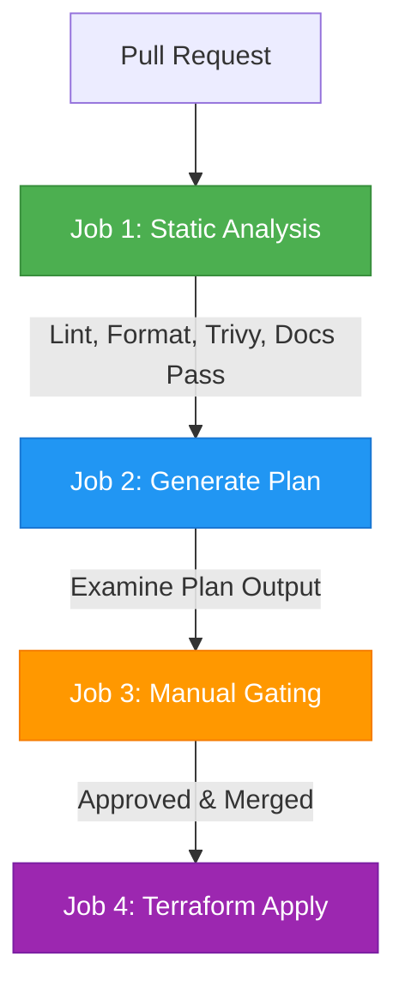

# Terraform CI/CD Pipeline Guide

This guide demonstrates how to configure a comprehensive, enterprise-ready Terraform CI/CD pipeline. It features automated static checks, vulnerability scanning, plan outputs on Pull Requests, manual gating, and automatic application upon merge.

## Use Case

Manually running `terraform apply` from local developer workstations introduces security vulnerabilities, config drifts, and deployment errors.

An ideal GitOps Terraform pipeline must:
1. **Lint and Format**: Verify code compliance.
2. **Validate**: Ensure internal dependency integrity.
3. **Security Scan**: Look for cloud resource misconfigurations or high-severity vulnerabilities.
4. **Plan**: Show exactly what changes are being made on Pull Requests.
5. **Gating**: Require manual engineering approvals before modifying production states.
6. **Apply**: Seamlessly execute modifications post-merge.

## Architecture Flow



## Workflow Implementation

Here is how you can set up this complete lifecycle using our DRY reusable workflows:

```yaml
name: Enterprise Terraform CI/CD

on:
  pull_request:
    branches: [ main ]
    paths: [ 'terraform/**' ]
  push:
    branches: [ main ]
    paths: [ 'terraform/**' ]

env:
  CONFIGURATION: 'azurerg-service'
  ENVIRONMENT: 'dev'

jobs:
  # Stage 1: Runtime Setup
  setup-runtime:
    uses: ./.github/workflows/rwf-container-build-and-push.yaml
    with:
      overwrite: false

  # Stage 2: Static Analysis (Runs on PRs and merges)
  # Checks formatting, runs validation, generates docs comparison, scans with Trivy, and runs tflint.
  static-analysis:
    needs: [ setup-runtime ]
    uses: ./.github/workflows/rwf-terraform-static-analysis.yaml
    with:
      container_image: ${{ needs.setup-runtime.outputs.container_image }}
      configuration: 'azurerg-service'
      environment: 'dev'

  # Stage 3: Generate Execution Plan (Runs on Pull Requests)
  terraform-plan:
    needs: [ setup-runtime, static-analysis ]
    if: github.event_name == 'pull_request'
    uses: ./.github/workflows/rwf-terraform-plan.yaml
    with:
      container_image: ${{ needs.setup-runtime.outputs.container_image }}
      configuration: 'azurerg-service'
      environment: 'dev'
      arm_use_oidc: true
    secrets:
      ARM_CLIENT_ID: ${{ secrets.ARM_CLIENT_ID }}
      ARM_SUBSCRIPTION_ID: ${{ secrets.ARM_SUBSCRIPTION_ID }}
      ARM_TENANT_ID: ${{ secrets.ARM_TENANT_ID }}

  # Stage 4: Manual Approval Gate & Deploy (Runs on branch merges)
  terraform-deploy:
    needs: [ setup-runtime ]
    if: github.event_name == 'push' && github.ref == 'refs/heads/main'
    uses: ./.github/workflows/rwf-terraform-deployment-ci.yaml
    with:
      container_image: ${{ needs.setup-runtime.outputs.container_image }}
      configuration: 'azurerg-service'
      environment: 'dev'
      arm_use_oidc: true
    secrets:
      ARM_CLIENT_ID: ${{ secrets.ARM_CLIENT_ID }}
      ARM_SUBSCRIPTION_ID: ${{ secrets.ARM_SUBSCRIPTION_ID }}
      ARM_TENANT_ID: ${{ secrets.ARM_TENANT_ID }}
```

## Key Capabilities

1. **State Recovery**: If your state becomes corrupted, you can easily use the **restate** workflow (`rwf-terraform-restate.yaml`) to clean up local or Azure storage blobs and re-initialize from scratch.
2. **Matrix Deployment**: For multi-region configurations, easily scale this pipeline out using the matrix deployment helper (`rwf-terraform-matrix-deployment-ci.yaml`).
3. **No Credential Exposure**: Authenticates securely using Azure Workload Identity (OpenID Connect / OIDC) rather than storing static client secrets.
